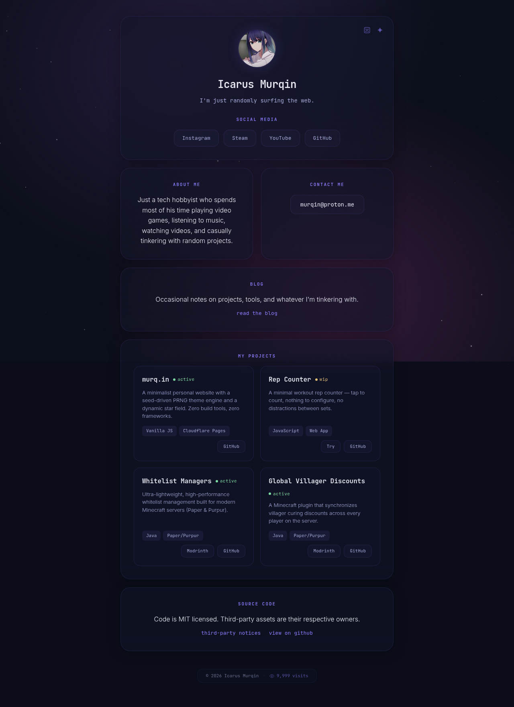

<div align="center">

# murq.in 🪐

**Icarus Murqin's personal minimalist space. Randomly surfing the web.**

[](https://murq.in)
[](./LICENSE)



</div>

---

## ✨ Features

- **🌀 Seeded PRNG System:** Utilizes the custom `mulberry32` algorithm to resolve unique themes dynamically via 12-character hexadecimal path hashes (`6-char gradient + 6-char starfield`).
- **🌌 Dynamic Starfield Twinkling:** Renders synchronized, canvas-based twinkling stardust configurations mapped strictly to active seed values.
- **🔮 Glassmorphic UI Aesthetics:** Beautiful, CSS-animated container grid designed around modern glassmorphism transparency, backdrop filters, and Akane-inspired color variables (`#8B7EFF`).
- **👁️ Serverless Edge Visitor Counter:** Powered by Cloudflare Pages Functions and Cloudflare KV store, tracking session-safe unique page visits instantly.
- **🚀 Zero Build Step:** Handcrafted utilizing purely native web technologies (pure HTML5, CSS3, and Vanilla JavaScript) for optimal browser rendering performance.

---

## 🛠️ Technology Stack

- **Frontend Core:** HTML5, CSS3 Custom Properties, Vanilla ES6 JavaScript
- **Backend API:** Cloudflare Pages Functions (Serverless Edge Workers)
- **Database:** Cloudflare KV Namespace (Edge Storage)
- **Typography:** [JetBrains Mono](https://www.jetbrains.com/lp/mono/) & [Inter](https://rsms.me/inter/)
- **Infrastructure:** Cloudflare Pages (Continuous Integration pipeline)

---

## ⚙️ Cloudflare KV Binding Configuration

To enable the visitor counter in your live environment, configure the KV binding in your Cloudflare dashboard:

1. **Create a KV Namespace:** Go to **Cloudflare Dashboard** -> **Workers & Pages** -> **KV** and create a namespace named `murqin-kv`.
2. **Bind to Pages:** Go to **Workers & Pages** -> **Pages** -> **murq.in** -> **Settings** -> **Functions**.
3. Under **KV namespace bindings**, add a new binding:
   - **Variable name:** `KV`
   - **KV namespace:** Select `murqin-kv`
4. Redeploy your site.

---

## 📂 File Architecture

```text
murq.in/
├── assets/
│   ├── avatar.png          # Profile avatar asset
│   ├── favicon.svg         # Star/Wing SVG branding
│   └── fonts/              # Self-hosted Inter & JetBrains Mono (woff2)
├── functions/
│   ├── api/visitors.js     # Visitor counter (Cloudflare Pages Function + KV)
│   └── blog.js             # Injects per-post OG meta into /blog?post=…
├── posts/                  # Blog posts as plain markdown files
├── tools/
│   ├── new-post.sh         # One-command flow: scaffold -> $EDITOR -> update-rss
│   ├── new-post.js         # Interactive scaffold: creates the .md + index entry
│   ├── delete-post.js      # Removes a post (index entry + .md) and refreshes feed
│   └── update-rss.js       # Run on new post: validates, lints, refreshes rss.xml
├── index.html              # Main page markup & semantic metadata
├── blog.html               # Blog: post list & single-post view (?post=slug)
├── script.js               # Seed parsing logic & dynamic starfield renderer
├── projects.js             # Project data module rendered into the main page
├── posts.json              # Post index (slug, title, date, summary) — single source
├── markdown.js             # Tiny dependency-free markdown renderer
├── blog.js                 # Blog page rendering logic
├── rss.xml                 # Generated RSS feed (do not edit by hand)
├── style.css               # Geist-inspired translucent variables & layouts
├── _redirects              # SPA catch-all so seed URLs serve index.html
├── LICENSE                 # MIT License details
└── LICENSES.md             # Third-party attribution notices
```

### ✍️ Adding a blog post

One command: `tools/new-post.sh` — scaffolds the post, opens it in `$EDITOR`,
then validates and refreshes the feed when you save and quit.

Or step by step:

1. Run `node tools/new-post.js` — it asks for title/slug/date/summary, creates
   an empty `posts/<slug>.md`, and adds the entry to `posts.json`.
2. Write the post in `posts/<slug>.md` (the title comes from the index — no
   `h1` in the file).
3. Run `node tools/update-rss.js` — it validates the post index, lints the
   content, regenerates `rss.xml`, and stages it. Then commit everything.

(Steps can also be done by hand: create the file, add the `posts.json` entry,
run `update-rss.js`.)

---

## 🚀 Running Locally

1. Clone the repository:
   ```bash
   git clone https://github.com/murqin/murq.in.git
   cd murq.in
   ```
2. Simply open `index.html` inside any modern web browser or serve it locally using a lightweight server:
   ```bash
   python -m http.server 8000
   ```

---

## 📄 Licensing

- **Codebase:** Distributed under the terms of the MIT License — see [LICENSE](./LICENSE).
- **Media & Fonts:** Third-party notices and asset licensing are detailed in [LICENSES.md](./LICENSES.md).

---

<div align="center">
Built by Icarus Murqin • 2026
</div>
