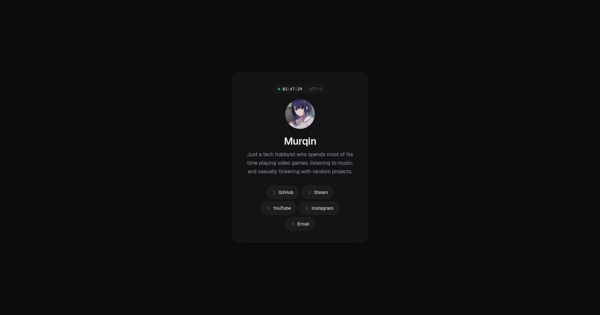

  
   
  <h1>murq.in</h1>
  
Minimalist, matte-opaque dark personal bio website.

---

### Highlights

- **Pure & Lightweight:** Zero JS frameworks, zero external CDN requests, total payload < 25 KB.
- **Typography:** 100% self-hosted **Geist Sans** and **Geist Mono** with optimized OpenType features and preloads.
- **Micro-interactions:** 
  - Inline email copy morph with clipboard feedback.
  - Keyboard navigation (`1` GitHub, `2` Steam, `3` YouTube, `4` Instagram, `5` Email).
  - Real-time local time (`UTC+3`) and status badge with tabular numerals.
- **Docker-ready:** High-performance `nginx:alpine-slim` setup with Gzip (level 6), immutable asset caching, and security headers.

---

### License & Disclaimer

© 2026 Murqin. All Rights Reserved.

The source code and personal content are All Rights Reserved. Third-party assets, fonts, and trademarks belong to their respective owners. See [LICENSES.md](LICENSES.md) for detailed third-party attributions and licenses.
