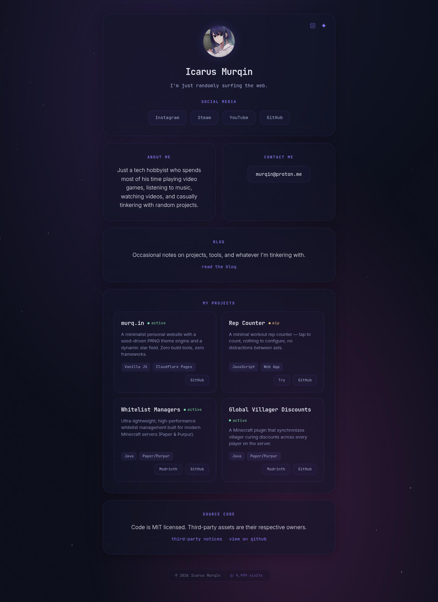

<div align="center">

# murq.in 🪐

**Icarus Murqin's personal minimalist space. Randomly surfing the web.**

[](https://murq.in)
[](./LICENSE)



</div>

---

## ✨ Features

- **🌀 Seeded PRNG System:** A custom `mulberry32` implementation resolves a unique theme from a 12-character hexadecimal path (`6-char gradient + 6-char starfield`), so `/1a2b3c4d5e6f` always renders the same sky.
- **🌌 Dynamic Starfield Twinkling:** Twinkling stardust laid out strictly from the active seed, with mouse parallax and the occasional shooting star.
- **🔮 Glassmorphic UI Aesthetics:** CSS-animated container grid built on transparency, backdrop filters, and Akane-inspired colour variables (`#8B7EFF`).
- **📝 Real pages per post:** Every post is a pre-rendered document at `/blog/<slug>/` with its own Open Graph metadata, so link previews and crawlers see the actual post.
- **👁️ Visitor Counter:** Served by the site's own Node process; the count lives in a JSON file on a mounted volume.

---

## 🛠️ Technology Stack

- **Site:** [Astro](https://astro.build) (static output) + TypeScript
- **Content:** Markdown in `src/content/blog/`, validated at build time by a Zod schema
- **Frontend:** CSS3 Custom Properties, TypeScript compiled to a single module
- **Server:** ~250 lines of Node, zero runtime dependencies
- **Typography:** [JetBrains Mono](https://www.jetbrains.com/lp/mono/) & [Inter](https://rsms.me/inter/)
- **Infrastructure:** Self-hosted behind [Cosmos Cloud](https://cosmos-cloud.io); image built by GitHub Actions and published to GHCR

---

## 📂 File Architecture

```text
murq.in/
├── src/
│   ├── content/blog/       # Blog posts (markdown + frontmatter) — the only source
│   ├── content.config.ts   # Zod schema: a post missing a field fails the build
│   ├── data/projects.ts    # Project list, rendered at build time
│   ├── layouts/Base.astro  # The one <head>, background layers and footer
│   ├── components/         # Projects, Footer
│   ├── lib/date.ts         # Shared UTC date formatting
│   ├── scripts/theme.ts    # Seed engine, starfield, copy buttons, counter fetch
│   └── pages/
│       ├── index.astro
│       ├── 404.astro
│       ├── rss.xml.ts          # Feed, generated from the collection
│       ├── posts/[slug].md.ts  # Raw markdown at /posts/<slug>.md
│       └── blog/
│           ├── index.astro     # Post list
│           └── [...slug].astro # One page per post
├── public/                 # Copied verbatim: style.css, robots.txt, assets/
├── server/src/server.ts    # Static host + seed fallback + visitor counter
├── docs/preview.png        # README screenshot (not shipped with the site)
├── tools/screenshot.js     # Regenerates docs/preview.png (needs puppeteer)
├── Dockerfile              # Multi-stage: build the site, then run the server
└── .github/workflows/      # Builds linux/arm64 and pushes to GHCR
```

### ✍️ Adding a blog post

Create `src/content/blog/<slug>.md` with frontmatter:

```markdown
---
title: The post title
date: 2026-08-22
summary: One sentence, used in the list, the feed and the link preview.
---

The post body. No `h1` — the title above is rendered for you.
```

Commit and push. The post page, the list entry, the RSS item, the sitemap entry
and the Open Graph tags are all generated from that one file. A missing or
malformed field fails the build rather than shipping a broken page.

---

## 🚀 Running Locally

```bash
git clone https://github.com/murqin/murq.in.git
cd murq.in
npm install
npm run dev          # http://localhost:4321
```

`astro dev` serves the pages but not the Node server's own routes. To exercise
seed URLs (`/1a2b3c4d5e6f`), the legacy `/blog?post=…` redirects and the visitor
counter, run the real thing:

```bash
npm run build:all    # astro check + astro build + tsc for the server
npm run serve        # http://localhost:8080
```

### Server configuration

| Variable | Default | Purpose |
| --- | --- | --- |
| `PORT` | `8080` | Listen port |
| `SITE_ROOT` | `/srv/site` | Directory holding the built site |
| `DATA_DIR` | `/data` | Where `visitors.json` lives — must be writable |
| `ALLOWED_ORIGINS` | `https://murq.in` | Comma-separated origins allowed to increment the counter |

The container runs as uid 1000, so the mounted data directory has to be owned by
it (`chown -R 1000:1000 <host dir>`). The server refuses to start otherwise
rather than silently losing the count on every restart.

---

## 📄 Licensing

- **Codebase:** Distributed under the terms of the MIT License — see [LICENSE](./LICENSE).
- **Media & Fonts:** Third-party notices and asset licensing are detailed in [LICENSES.md](./LICENSES.md).

---

<div align="center">
Built by Icarus Murqin • 2026
</div>
